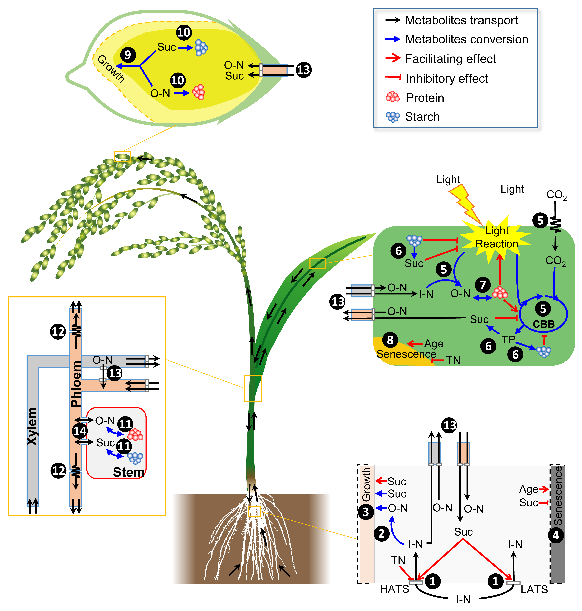

# WACNI-rice

## Introduction
Carbon and nitrogen metabolism play a crucial role in the growth and development of plants. In order to directly predict grain yield based on molecular processes occurring in various organs involved in source, sink, and transport, we have developed a mechanistic model called Whole plAnt Carbon Nitrogen Interaction (WACNI).

Unlike previous methods that focused solely on phloem sucrose transport from leaves to grains or relied on predetermined sink growth patterns, WACNI introduces a key innovation by integrating all essential biochemical and biophysical processes into a comprehensive model. This integration allows for the dynamic simulation of authentic biological dynamics within a rice plant, encompassing the entire growth cycle from flowering to harvest, and operating at a second-by-second time scale.

One advantage of this model is its ability to eliminate the reliance on predefined growth patterns. As a result, it provides a more accurate representation of the underlying biological processes. Moreover, this feature opens up new possibilities for the rational optimization of fundamental biochemical and biophysical processes to achieve higher grain yields.

<p align="center">
  
</p>

WACNI is a comprehensive model that incorporates both carbon and nitrogen metabolism. It achieves this by employing ordinary differentiation equations to kinetically simulate the rates of major biochemical and physiological processes within a plant. The model encompasses fourteen distinct types of biochemical and biophysical processes that occur in various source, sink, and transport organs.

These processes encompass a range of activities, including the assimilation, transport, and utilization of six essential primary metabolites. These metabolites consist of triose phosphates (TP), sucrose (Suc), starch, inorganic nitrogen (I-N) in the form of NH4+ and NO3-, free organic nitrogen (O-N) in the form of amino acids and amides, as well as proteins. The following is a list of the fourteen groups of processes that are simulated by the model:

> 1, root nitrogen uptake; 
> 
> 2, root nitrogen assimilation; 
> 
> 3, root growth; 
> 
> 4, root senescence; 
> 
> 5, leaf CO2 and nitrogen assimilation; 
> 
> 6, leaf triose phosphate, sucrose and starch interconversion; 
> 
> 7, leaf organic nitrogen and protein interconversion; 
> 
> 8, leaf senescence; 
> 
> 9, grain growth; 
> 
> 10, grain starch and protein synthesis; 
> 
> 11, stem sucrose and starch, organic nitrogen and protein interconversion; 
> 
> 12, phloem transport; 
> 
> 13, transmembrane transport; 
> 
> 14, symplastic diffusion between phloem and stem. 


WACNI goes beyond modeling biochemical and physiological processes alone and incorporates their interaction with key plant developmental processes. These include root growth, grain volume expansion (endosperm cell division), grain filling (starch and protein synthesis in the endosperm), root senescence, and leaf senescence.

An important aspect of WACNI is its ability to simulate plant growth within a canopy, accounting for neighboring plants at user-defined row and column distances. This allows for the consideration of shared incident radiation and soil nitrogen between plants. To accurately represent canopy photosynthesis, the model employs a sun-shade model. Additionally, a custom-built 1-dimensional root metabolism model has been developed to simulate various processes such as root nitrogen uptake, nitrogen assimilation, root growth, and root senescence. This root metabolism model is based on previous experimental and theoretical studies.

The inclusion of these features enables the easy scaling of single plant simulation results to a whole canopy. By multiplying the results with a factor representing plant density per unit area, WACNI provides insights into the behavior and dynamics of an entire plant community. 

<p align="center">
  
</p>

WACNI adopts a modular design approach, which facilitates its organization and comprehensibility. The model is composed of six distinct modules, namely root, leaf, grain, stem (including culm and sheath), transport (vascular transport system encompassing xylem and phloem), and respiration. The exchange of metabolites between modules occurs through trans-membrane transport mechanisms. Each module consists of several sub-models that have been well-established in previous research or newly developed in this study.

For instance, the sun-shade canopy photosynthesis model, stomatal conductance model, phloem transport model, and organ respiration model are among the established sub-models incorporated into WACNI. These sub-models contribute to the accurate representation of specific physiological processes within the respective modules. In cases where established sub-models are not available, WACNI incorporates newly developed sub-models. Examples of these include the root metabolism model, grain development and storage model, and stem metabolite homeostasis model.

The modular design of WACNI allows for the integration of diverse sub-models, ensuring a comprehensive representation of plant metabolic processes and interactions. This approach facilitates the model's flexibility, scalability, and ability to address specific aspects of plant growth and development.

<p align="center">
  
</p>

The model takes into account various input variables, including 1) kinetic parameters for each process, 2) initial metabolite concentrations, and 3) the carbon and nitrogen mass present in different organs at the flowering stage. These inputs serve as the foundation for the bottom-up simulation conducted by the model.

By integrating these inputs and simulating the biochemical and physiological processes at the organ level, WACNI generates comprehensive outputs that encompass all types of plant-level physiological dynamics from the flowering stage to harvest. These outputs emerge as a result of the model's ability to capture the intricate interactions and dynamics of carbon and nitrogen metabolism within the plant.

Through this bottom-up simulation approach, WACNI provides valuable insights into the physiological behaviors of the plant as it progresses through its life cycle. It serves as a powerful tool for understanding and predicting plant growth and development, ultimately aiding in the optimization of agricultural practices and the enhancement of grain yield.


## System Requirements
### Hardware requirements
`WACNI-rice` package requires only a standard computer with enough RAM to support the in-memory operations. 

### Software requirements
#### OS Requirements
The developmental version of the package has been tested on the following systems:
+ Windows
+ Linux 

#### MATLAB
WACNI is developed under MATLAB (the MathWorks Inc., Natick, MA, USA) (version >= 2012b).


## Usage
WACNI can be run from the command window of MATLAB.

### Files
The `WACNI-rice` package contains the following essential files for running the WACNI model.

> RunModel.m
> 
> simulation_main.m
> 
> MyEventFunction.m
> 
> GA_for_evolutionaryPopulation.m
> 
> weather_input.txt


###  1. Basic simulation (1)
To initiate a basic simulation without displaying the plant carbon and nitrogen economy during grain filling, you can execute the following commands within the MATLAB command window:

```
c=num2cell(ones(1,49));
[Tt,simulation]=RunModel(c,0,0,0,0);
```

###  2. Basic simulation (2)
To initiate a basic simulation with displaying the plant carbon and nitrogen economy during grain filling, you can execute the following commands within the MATLAB command window:

```
c=num2cell(ones(1,49));
[Tt,simulation]=RunModel(c,0,0,0,1);
```

###  3. Basic simulation (3)
To modify a specific parameter and run the simulation once (e.g., changing c{7}: coef_K_protein_oN_leaf_cat to 0.5), you can use the following commands in MATLAB:

```
c=num2cell(ones(1,49));
c{7}=0.5;
[Tt,simulation]=RunModel(c,0,0,0,0);
```

Note: The following list provides the mapping between the index and parameters:


|    Index    | Parameter |
| -------- | ----------- |
|c{1}|Prefix of output txt file|
|c{2}|Prefix of output plot file|
|c{3}|coef\_Vc_J|
|c{4}|coef\_PPFD|
|c{5}|coef\_Area_leaf|
|c{6}|coef\_Phi_CO2|
|c{7}|coef\_K\_protein\_oN\_leaf\_cat|
|c{8}|coef\_lower\_car\_photo|
|c{9}|coef\_K\_oN\_leaf\_load\_cat|
|c{10}|coef\_K\_suc\_leaf\_load\_cat|
|c{11}|coef\_K\_N\_assimi\_leaf\_cat|
|c{12}|coef\_K\_TP\_suc\_leaf\_cat|
|c{13}|coef\_K\_TP\_starch\_leaf\_cat|
|c{14}|coef\_K\_starch\_suc\_leaf\_cat|
|c{15}|coef\_K\_oN\_protein\_leaf\_cat|
|c{16}|coef\_conc\_lower\_oN\_to\_leaf\_protein|
|c{17}|coef\_K\_iN\_leaf\_unload\_cat|
|c{18}|coef\_gamma_star| 
|c{19}|coef\_grain_number|
|c{20}|coef\_K\_grain\_growth\_cat|
|c{21}|coef\_K\_grain\_starch\_store\_cat|
|c{22}|coef\_K\_suc\_grain\_unload\_cat|
|c{23}|coef\_K\_grain\_protein\_store\_cat|
|c{24}|coef\_K\_oN\_grain\_unload\_cat|
|c{25}|coef\_grain\_width\_max|
|c{26}|coef\_grain\_length\_width\_ratio|
|c{27}|coef\_Starch\_stem|
|c{28}|coef\_K\_suc\_starch\_stem\_cat|
|c{29}|coef\_K\_starch\_suc\_stem\_cat|
|c{30}|coef\_K\_oN\_protein\_stem\_cat|
|c{31}|coef\_K\_protein\_oN\_stem\_cat|
|c{32}|coef\_Fresh\_root|
|c{33}|coef\_conc\_iN\_soil|    
|c{34}|coef\_K\_iN\_absorb\_cat|
|c{35}|coef\_K\_iN\_root\_load\_cat|
|c{36}|coef\_K\_oN\_root\_load\_cat|
|c{37}|coef\_K\_suc\_root\_unload\_cat|
|c{38}|coef\_K\_oN\_root\_unload\_cat|  
|c{39}|coef\_K\_N\_root\_assimi\_cat|
|c{40}|coef\_K\_root\_growth\_cat|
|c{41}|coef\_R\_l\_s\_phloem0|
|c{42}|coef\_R\_r\_l\_phloem0|
|c{43}|coef\_K\_oN\_xylem\_to\_lphloem\_cat|
|c{44}|coef\_tillerNum|
|c{45}|coef\_CO2a|
|c{46}|protein\_content\_leaf|
|c{47}|grain\_struct\_N|
|c{48}|stem\_struct\_mass|
|c{49}|protein\_stem|


###  4. Simulating different nitrogen regimes

To simulate different nitrogen treatments reported in  [Zhao et al. (2015)](https://doi.org/10.1016/j.jcs.2015.03.011), using the following commands:

```
c=num2cell(ones(1,49));

c{1}='MN';c{2}=c{1};c{33}=1;c{46}=1;c{49}=1;c{19}=1;c{44}=1;c{44}=11/12; RunModel(c,0,0,0,0);

c{1}='0N';c{2}=c{1};c{33}=0.2;c{46}=0.66;c{49}=0.66;c{19}=0.43/0.6;c{44}=0.6*11/12; RunModel(c,0,0,0,0);

c{1}='LN';c{2}=c{1};c{33}=0.5;c{46}=0.84;c{49}=0.84;c{19}=0.75/0.9;c{44}=0.9*11/12; RunModel(c,0,0,0,0);

c{1}='HN';c{2}=c{1};c{33}=1.5;c{46}=0.98;c{49}=0.98;c{19}=1.18/1.23;c{44}=1.23*11/12; RunModel(c,0,0,0,0);

```
The meaning of the abbreviations used in the code is listed as follows:

|    Abbr    | Description |
| -------- | ----------- |
|  MN  | Medium nitrogen |
|  0N  | No nitrogen |
|  LN   | Low nitrogen |
|  HN   | High nitrogen |


###  5. Simulating different light regimes
To simulate different lighting regimes reported in  [Kobata et al. (2000)](https://doi.org/10.2134/agronj2000.923411x), using the following commands:

```
c=num2cell(ones(1,49));

c{1}='CK';c{2}=c{1}; RunModel(c,0,0,0,0);

c{1}='S10_25';c{2}=c{1}; RunModel(c,25,1,0,0);

c{1}='S10_50';c{2}=c{1}; RunModel(c,50,1,0,0);

c{1}='S10_75';c{2}=c{1}; RunModel(c,75,1,0,0);

c{1}='S10_25_Sp50';c{2}=c{1}; RunModel(c,25,1,50,0);

c{1}='S10_50_Sp50';c{2}=c{1}; RunModel(c,50,1,50,0);

c{1}='S10_75_Sp50';c{2}=c{1}; RunModel(c,75,1,50,0);
```

The abbreviations used in the code have the following meanings:

|    Abbr    | Description |
| -------- | ----------- |
|  CK  | Normal condition |
|  S10_25  | Shading 25% at the first 10 days|
|  S10_50   | Shading 50% at the first 10 days|
|  S10_75   | Shading 75% at the first 10 days|
|  S10_25_Sp50  | Shading 25% followed by 50% spacing|
|  S10_50_Sp50   | Shading 50% followed by 50% spacing|
|  S10_75_Sp50   | Shading 75% followed by 50% spacing|


###  6. Simulating different soil-nitrogen & air-CO2 concentration combinations
To simulate different soil nitrogen & air CO2 concentrations reported in  [Kim et al. (2001)](https://doi.org/10.1046/j.1469-8137.2001.00111.x), using the following commands:

```
c=num2cell(ones(1,49));c{1}='MN';c{2}=c{1};c{19}=145/160;c{45}=390/400; RunModel(c,0,0,0,0);

c=num2cell(ones(1,49));c{1}='LN';c{2}=c{1};c{19}=145/160;c{25}=1.07^(1/3);c{44}=0.87;c{5}=0.87/c{44};c{32}=1/c{44};c{48}=0.87/c{44};c{27}=0.87/c{44};c{4
9}=0.95;c{19}=c{19}*0.96;c{46}=0.95;c{33}=0.5;c{45}=390/400; RunModel(c,0,0,0,0);

c=num2cell(ones(1,49));c{1}='HN';c{2}=c{1};c{19}=145/160;c{25}=0.98^(1/3);c{44}=1.07;c{5}=1.06/c{44};c{32}=1.03/c{44};c{48}=1.06/c{44};c{27}=1.06/c{44};
c{49}=1.17;c{19}=c{19}*1.05;c{46}=1.18;c{33}=1.5;c{45}=390/400; RunModel(c,0,0,0,0);

c=num2cell(ones(1,49));c{1}='LN-
FACE';c{2}=c{1};c{19}=145/160;c{25}=1.09^(1/3);c{22}=1;c{44}=0.89;c{5}=1.21/c{44};c{32}=1.18/c{44};c{48}=1.21/c{44};c{27}=1.21/c{44};c{49}=0.96;c{19}=c{
19}*0.95;c{46}=0.70;c{33}=0.5;c{45}=690/400; RunModel(c,0,0,0,0);

c=num2cell(ones(1,49));c{1}='MN-
FACE';c{2}=c{1};c{19}=145/160;c{25}=1.04^(1/3);c{22}=1;c{44}=1.09;c{5}=1.45/c{44};c{32}=1.46/c{44};c{48}=1.45/c{44};c{27}=1.45/c{44};c{49}=1.06;c{19}=c{
19}*1.01;c{46}=0.79;c{33}=1;c{45}=690/400; RunModel(c,0,0,0,0);

c=num2cell(ones(1,49));c{1}='HN-
FACE';c{2}=c{1};c{19}=145/160;c{25}=0.93^(1/3);c{22}=1;c{44}=1.15;c{5}=1.51/c{44};c{32}=1.35/c{44};c{48}=1.51/c{44};c{27}=1.51/c{44};c{49}=1.33;c{19}=c{
19}*1.13;c{46}=1.01;c{33}=1.5;c{45}=690/400; RunModel(c,0,0,0,0);

```


To simulate `vm_Nupt=64%` under FACE condition, using the following commands: 

```
c=num2cell(ones(1,49));c{1}='LN-FACE-
vm_Nup64';c{2}=c{1};c{19}=145/160;c{25}=1.09^(1/3);c{22}=1;c{34}=0.64;c{44}=0.89;c{5}=1.21/c{44};c{32}=1.18/c{44};c{48}=1.21/c{44};c{27}=1.21/c{44};c{49
}=0.96;c{19}=c{19}*0.95;c{46}=0.70;c{33}=0.5;c{45}=690/400; RunModel(c,0,0,0,0);

c=num2cell(ones(1,49));c{1}='MN-FACE-
vm_Nup64';c{2}=c{1};c{19}=145/160;c{25}=1.04^(1/3);c{22}=1;c{34}=0.64;c{44}=1.09;c{5}=1.45/c{44};c{32}=1.46/c{44};c{48}=1.45/c{44};c{27}=1.45/c{44};c{49
}=1.06;c{19}=c{19}*1.01;c{46}=0.79;c{33}=1;c{45}=690/400; RunModel(c,0,0,0,0);

c=num2cell(ones(1,49));c{1}='HN-FACE-
vm_Nup64';c{2}=c{1};c{19}=145/160;c{25}=0.93^(1/3);c{22}=1;c{34}=0.64;c{44}=1.15;c{5}=1.51/c{44};c{32}=1.35/c{44};c{48}=1.51/c{44};c{27}=1.51/c{44};c{49}=1.33;c{19}=c{19}*1.13;c{46}=1.01;c{33}=1.5;c{45}=690/400; RunModel(c,0,0,0,0);
```


The abbreviations used in the code have the following meanings:


|    Abbr    | Description |
| -------- | ----------- |
| MN| Medium nitrogen |
| LN| Low nitrogen|
| HN| High nitrogen|
| MN-FACE| Medium nitrogen with FACE|
| LN-FACE| Low nitrogen with FACE|
| HN-FACE| High nitrogen with FACE|
| MN-FACE-vm_Nup64| Medium nitrogen with FACE by assuming maximum root nitrogen uptake rate under FACE being 64% of that under ambient conditions|
| LN-FACE-vm_Nup64| Low nitrogen with FACE by assuming maximum root nitrogen uptake rate under FACE being 64% of that under ambient conditions|
| HN-FACE-vm_Nup64| High nitrogen with FACE by assuming maximum root nitrogen uptake rate under FACE being 64% of that under ambient conditions|


###  7. Simulating effect of different leaf protein degradation activity 

To simulate effect of the OsNAP gene alteration reported in  [Liang et al. (2014)](https://doi.org/10.1073/pnas.1321568111), using the following commands:

```
c=num2cell(ones(1,49));c{1}='OsNAP-WT';c{2}=c{1};c{19}=1;c{7}=0.5;c{48}=1;c{27}=1;c{49}=1;c{5}=1;c{32}=1; RunModel(c,0,0,0,0);

c=num2cell(ones(1,49));c{1}='OsNAP-mutant';c{2}=c{1};c{19}=0.735;c{7}=2;c{48}=0.735;c{27}=0.735;c{49}=0.735;c{5}=0.735;c{32}=0.735; RunModel(c,0,0,0,0);

c=num2cell(ones(1,49));c{1}='OsNAP-RNAi';c{2}=c{1};c{19}=1.11;c{7}=0.25;c{48}=1.11;c{27}=1.11;c{49}=1.11;c{5}=1.11;c{32}=1.11; RunModel(c,0,0,0,0);
```

The abbreviations used in the code have the following meanings:


|    Abbr    | Description |
| -------- | ----------- |
| OsNAP-WT| Wild type |
| OsNAP-mutant| ps1-D mutant|
| OsNAP-RNAi| OsNAP gene RNAi|


###  8. Simulating effect of different grain sucrose unloading activity

To simulate effect of the GIF1 gene alteration reported in  [Wang et al. (2008)](https://doi.org/10.1038/ng.220), using the following commands:

```
c=num2cell(ones(1,49));c{1}='GIF1-WT';c{2}=c{1};c{19}=90/160;c{48}=1/2;c{27}=1/2;c{49}=1/2;c{5}=1/2;c{32}=1/2;c{22}=2; RunModel(c,0,0,0,0);

c=num2cell(ones(1,49));c{1}='gif1';c{2}=c{1};c{19}=90/160;c{48}=1/2;c{27}=1/2;c{49}=1/2;c{5}=1/2;c{32}=1/2;c{22}=1;c{25}=0.92; RunModel(c,0,0,0,0);

c=num2cell(ones(1,49));c{1}='GIF1-OE';c{2}=c{1};c{19}=90/160;c{48}=1/2;c{27}=1/2;c{49}=1/2;c{5}=1/2;c{32}=1/2;c{22}=4;c{25}=1.04; RunModel(c,0,0,0,0);
```

To simulate effect of increasing the maximal grain sucrose unloading rate (c{22}) with sufficient large sink size, using the following commands:

```
c=num2cell(ones(1,49));c{1}='WT_s190';c{2}=c{1};c{19}=190/160;c{22}=1; RunModel(c,0,0,0,0);

c=num2cell(ones(1,49));c{1}='gif1_s190';c{2}=c{1};c{19}=190/160;c{22}=1/2; RunModel(c,0,0,0,0);

c=num2cell(ones(1,49));c{1}='GIF1_OE_s190';c{2}=c{1};c{19}=190/160;c{22}=2; RunModel(c,0,0,0,0);
```


The abbreviations used in the code have the following meanings:


|    Abbr    | Description |
| -------- | ----------- |
| GIF1-WT| Wild type |
| gif1 | gif1 gene mutant|
| GIF1-OE| GIF-1 gene overexpression|
| WT_s190| Wild type with large sink (190 grains per ear)|
| gif1_s190| Hypothetical gif1 gene mutant with large sink (190 grains per ear)|
| GIF1_OE_s190| Hypothetical GIF-1 gene overexpression with large sink (190 grains per ear)|


###  9. Simulating effect of different grain starch synthesis activity

To simulate effect of Sh2r6hs transforming reported in  [Smidansky et al. (2003)](https://doi.org/10.1007/s00425-002-0897-z), using the following commands:

```
c=num2cell(ones(1,49));c{1}='Sh2r6hs-WT';c{2}=c{1};c{19}=90/160;c{48}=1/2;c{27}=1/2;c{49}=1/2;c{5}=1/2;c{32}=1/2;c{21}=1; RunModel(c,0,0,0,0);

c=num2cell(ones(1,49));c{1}='Sh2r6hs-
OE';c{2}=c{1};c{19}=1.13*90/160;c{44}=1.05;c{25}=1.007;c{5}=1.22/1.05*1/2;c{32}=1.22/1.05*1/2;c{27}=1.22/1.05*1/2;c{48}=1.22/1.05*1/2;c{49}=1.22/1.05*1/
2;c{21}=1.5; RunModel(c,0,0,0,0);
```


To simulate effect of increasing the maximal grain starch synthesis rate (c{21}) without change in plant size at flowering, using the following commands:

```
c=num2cell(ones(1,49));c{1}='Sh2r6hs-OE-AGPonly';c{2}=c{1};c{19}=90/160;c{48}=1/2;c{27}=1/2;c{49}=1/2;c{5}=1/2;c{32}=1/2;c{21}=1.5; RunModel(c,0,0,0,0);
```


To simulate effect of changing plant size at flowering without increase in the maximal grain starch synthesis rate (c{21}) , using the following commands:

```
c=num2cell(ones(1,49));c{1}='Sh2r6hs-OE-
plantSizeOnly';c{2}=c{1};c{19}=1.13*90/160;c{44}=1.05;c{25}=1.007;c{5}=1.22/1.05*1/2;c{32}=1.22/1.05*1/2;c{27}=1.22/1.05*1/2;c{48}=1.22/1.05*1/2;c{49}=1
.22/1.05*1/2;c{21}=1; RunModel(c,0,0,0,0);
```

The abbreviations used in the code have the following meanings:

|    Abbr    | Description |
| -------- | ----------- |
| Sh2r6hs-WT| Wild type |
| Sh2r6hs-OE| Sh2r6hs gene overexpression |
| Sh2r6hs-OE-AGPonly| Sh2r6hs gene overexpression with assuming only grain AGP activity altered|
| Sh2r6hs-OE-plantSizeOnly| Sh2r6hs gene overexpression with assuming only plant size at flowering altered|


###  10. Perturbing all model parameters one by one

To test model behavior by perturbing all model parameters one by one, using the following commands:

```
para_list=...

    [[1,1];[1,1];[1,1];[1,1];[0.5,2];... % invariant: A_Jmax, PPFD,leaf_area, Phi_CO2

    [1,1];[0.5,2];[0.5,2];[0.5,2];[0.5,2];... % invariant: [NSC]inhibit_A_low
    
    [0.5,2];[0.5,2];[0.5,2];[1,1];[0.5,2];... % invariant: [O-N]leaf_protein_syn_low
    
    [1,1];[1,1];[0.5,2];[0.5,2];[0.5,2];... % invariant: gamma_star, seed_number
    
    [0.5,2];[0.5,2];[1,1];[1,1];[1,1];... % invariant: seed_width_max, seed_length_width_ratio, stem_starch_content
    
    [0.5,2];[0.5,2];[0.5,2];[0.5,2];[1,1];... % invariant: root_weight
    
    [1,1];[0.5,2];[0.5,2];[0.5,2];[0.5,2];... % invariant: soil_iN_conc
    
    [0.5,2];[0.5,2];[0.5,2];[0.5,2];[0.5,2];... % invariant: 
    
    [0.5,2];[1,1];[1,1];[1,1];[1,1];[1,1];[1,1]]; % invariant: tiller_number; CO2a; leaf_protein_content; seed_struct_N; stem_struct; stem_protein_content

seedNum=190/160;

candi_pos=[5,7:13,15,18:22,26:29,32:41]; % 28 variables

candi_name={'leafP2ON','leafONload','leafSUCload','leafIN2ON','leafTP2SUC','leafTP2STAR','leafSTAR2SUC','leafON2P','leafINunload',...
    'seedGrow','seedSTARstore','seedSUCunload','seedPstore','seedONunload','stemSUC2STAR','stemSTAR2SUC','stemON2P','stemP2ON',...
    'rootINabsorb','rootINload','rootONload','rootSUCunload','rootONunload','rootIN2ON','rootGrow','phloemRLS','phloemRLR','xylemONload'};

count=0;

for i=11:28

    c_list=ones(1,47);
    
	c_list(17)=seedNum;
	
    for val=[0.1:0.1:0.9,2:1:10]
    
        c_list(candi_pos(i))=val;
	
        fnOutNA=[candi_name{i},'_',num2str(val)];
	
        if exist([fnOutNA,'.txt'], 'file')==2 % when there are existing files
	
            disp('****************************************************************');
	    
            disp([fnOutNA,' has been done! Skipping it ...']);
	    
            continue
	    
        end
	
        input_info=num2cell([1,1,c_list]);
	
        input_info{1}=fnOutNA;
	
        input_info{2}=fnOutNA;
	
		count=count+1;
		
        fprintf('echo the %s (%d) is running...\n',fnOutNA,count);
	
        RunModel(input_info,0,0,0,0);
	
    end
    
end
```


###  11. In silico design of rice grain filling ideotype for super-high yield

To perform a genetic algorithm optimization for identifying optimal parameter combinations maximizing grain yield on a Linux server, you can use the following commands in bash:

```
matlab -singleCompThread -nodesktop -nojvm -nosplash -nodisplay -r GA_for_evolutionaryPopulation;exit &
```

## How to Cite WACNI
Please cite the following manuscript:
>Bridging photosynthesis and crop yield formation with a mechanistic model of whole-plant carbon–nitrogen interaction. [in silico Plants, Volume 5, Issue 2, 2023, diad011](https://doi.org/10.1093/insilicoplants/diad011). <br>
Tian-Gen Chang, Zhong-Wei Wei, Zai Shi, Yi Xiao, Honglong Zhao, Shuo-Qi Chang, Mingnan Qu, Qingfeng Song, Faming Chen, Fenfen Miao, Xin-Guang Zhu


## License

WACNI is licensed under the GNU General Public License v3.0. <br>
If you have any questions, please submit them on the [GitHub issues page](https://github.com/rootchang/WACNI-rice/issues).

## Contact
Xin-Guang Zhu: zhuxg@cemps.ac.cn; Tiangen Chang: changtiangen@gmail.com 
